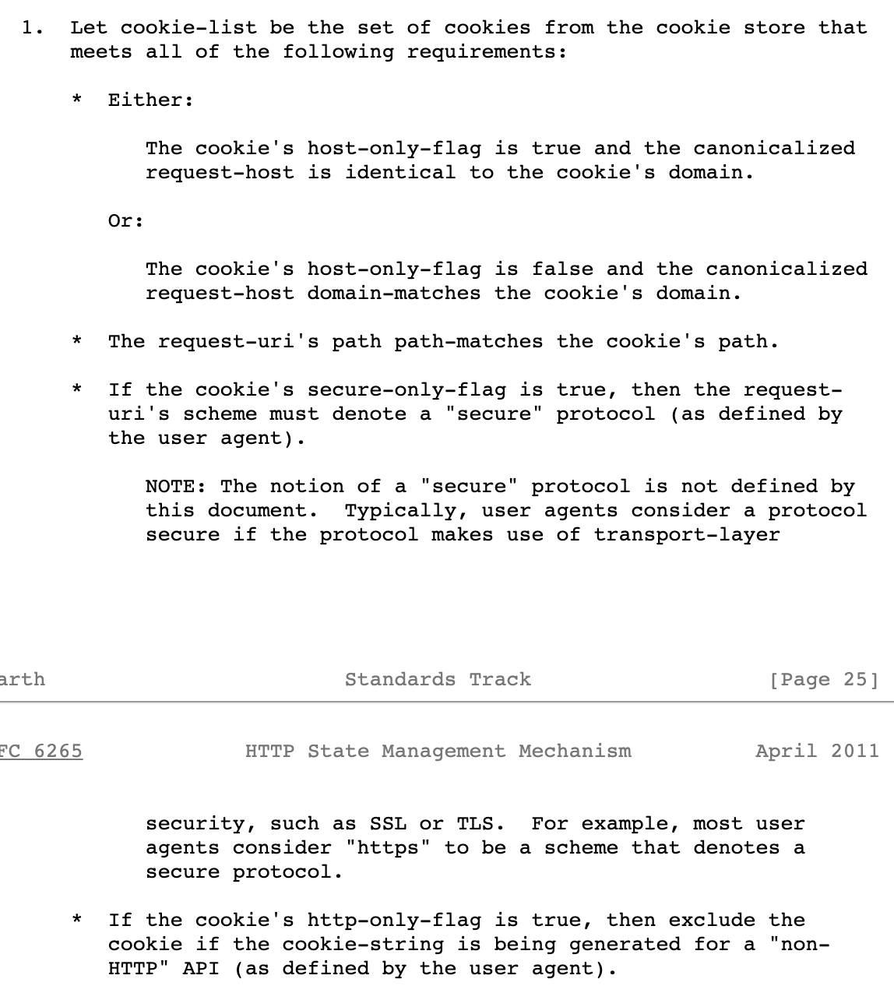

이 글은 예전 블로그에서 이전하면서 새로 다듬은 글입니다.

쿠키를 종종 사용하지만 여태 깊게 공부해야할 필요성을 딱히 못 느꼈던 것 같다. 솔직히 딱히 흥미로운 주제도 아니고 그렇다고 사용하는 게 어려운 것도 아니라서 그냥 지나쳐 왔는데 이번 글을 작성하며 정리를 한번 해보려 한다.

# Cookie의 옵션
쿠키는 서버와 클라이언트 각각에서 생성할 수 있다. 서버에서 생성하려면 response에 `set-cookie` 헤더를 이용하면 되고, 클라이언트에서는 `document.cookie`로 접근하면 된다. 어디에서 생성되던 간에 쿠키는 브라우저에 저장된다. 이제 쿠키의 옵션을 하나씩 알아보자.

## Domain
쿠키의 domain 값은 그 쿠키가 어디에서 생성된 쿠키인지 나타낸다. 쿠키를 생성할 때 도메인을 직접 지정해주지 않아도 도메인을 자동으로 설정해 주지만, 이 경우 서브 도메인에서는 쿠키의 접근이 불가능하다. 

`set-cookie` 헤더로 생성된 쿠키는 response를 보내준 서버의 도메인을 갖고, `document.cookie`로 클라이언트에서 생성한 쿠키는 `document.cookie`를 이용한 페이지의 도메인을 갖는다.

### First party Cookie? Third party Cookie?
쿠키의 도메인과 내가 현재 이용중인 사이트 도메인에 따라 First party cookie와 Third party cookie로 나뉜다. 내가 접속한 도메인과 같은 도메인을 갖는 쿠키(즉, 현재 접속한 사이트에서 만든 쿠키)를 First party cookie, 다른 도메인을 갖는 쿠키(현재 접속한 사이트가 아닌 외부 사이트에서 만든 쿠키)를 Third party cookie라고 부른다. 즉, 현재 내가 접속 중인 사이트에 따라 달라지는 상대적인 개념이다.

예를 들어, `siteA.com`의 한 페이지에서 `siteB.com`로 이미지 요청을 보내고 응답 헤더에 `set-cookie` 설정이 되어있다면 `siteB.com`을 도메인으로 하는 '쿠키C'가 브라우저에 저장된다. 이후, `siteA.com`가 아니더라도 `siteB.com`으로 요청을 보내는 일이 생기게 되면 요청 시 '쿠키C'를 함께 보내게 된다.

여기서 `siteB.com`로 부터 온 `set-cookie` 헤더를 통해 생성된 쿠키를 **Third party cookie(A사이트 입장에서)** 라 한다. 그리고 이 예시에서의 방식으로 배너 광고들이 작동한다. 여러 사이트에서 들어오는 요청의 쿠키를 통해 유저를 구분하고, 어느 사이트에서 요청이 왔는지를 체크해서 유저가 어떤 사이트를 방문하는지 확인하는 것이다.

조금 더 간단한 예시로 다시 한번 설명하자면, 'A도메인'에서 'B도메인'으로 요청할 때(이 요청은 A -> B 로의 페이지 이동이 될 수도 있고, 이미지 등의 요청이 될 수도 있다. 어떤 요청이든 무관하다.) 요청에 실려 전달되는 '쿠키C'는 'A도메인'에서는 Third party cookie이고 'B도메인'에서는 First party cookie이다. 즉, '쿠키C'는 'B도메인'에서 생성한 쿠키라는 뜻이다.

## Expires / Max-age
둘 다 쿠키의 유효기간을 나타내는 옵션이며, 둘 다 세팅이 안 되어있다면 해당 쿠키는 브라우저 종료 시 사라진다.(aka. 세션 쿠키)

## Secure
Secure flag가 true이면 http가 아닌 https에서만 이 쿠키를 전송할 수 있다는 의미이다.

## Path
도메인뿐만 아니라 세부적인 path를 설정할 수 있다. 보통 `path=/`로 두어서 도메인의 모든 path에서 쿠키에 접근이 가능하도록 설정한다.

## HttpOnly
쿠키의 HttpOnly flag가 true이면 이 쿠키는 `document.cookie`로 접근할 수 없다. 따라서 HttpOnly가 true인 쿠키는 오직 `set-cookie` 헤더를 통해서만 생성이 가능하다.

## SameSite
`None`, `Strict`, `Lax` 가 있다.

`None` 옵션을 가진 쿠키는 아무런 제약 없이 앞서 <HeadingLink href="#First%20party%20Cookie?%20Third%20party%20Cookie?">First party Cookie? Third party Cookie?</HeadingLink>에서 설명한 내용 그대로 적용된다.

`Strict` 옵션을 가진 쿠키는 First party cookie 일 때만 생성 및 전송이 가능하다. 즉, Third party cookie일 때는 요청 시 전송되지 않는다. 예를 들어, 현재 브라우저에 도메인이 `siteB.com`이고 `SameSite=Strict`인 '쿠키C'가 저장되어 있다고 가정하자. 이 상황에서 `siteA.com`에서 `siteB.com`으로 요청을 보내면 '쿠키C'는 요청에 포함되지 않는다. 원래라면 포함이 되었을 '쿠키C'가 `SameSite=Strict` 옵션 때문에 제외되는 것이다.

하지만 `SameSite=Strict` 옵션은 꽤나 불편하다. 브라우저에 `siteB.com` 사이트의 유저 데이터가 저장되어있음에도 `siteA.com`에서 `siteB.com`로 이동할 때 쿠키가 전달되지 않아 유저 인식을 하지 못하기 때문에 매번 유저 인증 과정이 필요하게 된다.

그래서 `Lax` 옵션이 필요하다. `Lax`는 `Strict`와 동일하지만 특정 조건을 만족하면 Third party cookie 이더라도 전달한다. 크롬에서는 다음과 같이 `Lax`에 대해 [설명한다.](https://www.chromium.org/administrators/policy-list-3/cookie-legacy-samesite-policies/)

> A cookie with "SameSite=Lax" will be sent with a same-site request, or a cross-site top-level navigation with a "safe" HTTP method.

해석해보자면 1) First party cookie 이거나, 2) Third party cookie 이더라도 `안전한 HTTP method`를 이용하면서 `top-level-navigation`이면 쿠키를 전달한다고 한다.

안전한 HTTP method란 [RFC 9110](https://developer.mozilla.org/en-US/docs/Glossary/Safe/HTTP)에 따르면 `GET`, `HEAD`, `OPTIONS`, `TRACE`을 뜻한다. top-level-navigation이란 최상위 컨텍스트의 이동을 말하는데, 쉽게 말하면 브라우저의 주소창 값이 바뀌는 경우이다. top-level-navigation에는 뭐가 있을까? 직접 주소창에 입력할 때, `<a>` 태그를 이용할 때, 301/302 리다이렉션을 할 때, `window.location.replace`를 할 때 등이 있다. 그럼 아닌 경우에는 뭐가 있을까? `` 태그에서 외부 소스로 요청을 보내는 경우, `<script>` 태그로 외부 스크립트를 요청하는 경우, `<iframe>` 내에서 페이지가 이동하는 경우 등이 있다.

### Quiz
Q) `set-cookie` 헤더로 `SameSite=Strict`인 쿠키를 생성하려면 어떤 조건이 필요할까?

A) `SameSite=Strict` 옵션을 가진 쿠키는 First party cookie 일 때만 생성 및 전송이 가능하다. `siteA.com`에서 응답을 보내준다고 하면 쿠키를 저장하려면 결국 응답을 받는 쪽의 도메인도 `siteA.com`이어야 한다.

# request의 cookie 헤더
`cookie` 헤더의 값이 어떤 알고리즘을 거쳐 만들어지는지 궁금해서 찾아보았다. [RFC 6265](https://www.rfc-editor.org/rfc/rfc6265.html#section-5.4)에 따르면 쿠키가 request의 `cookie` 헤더에 담기기까지 총 4단계의 과정을 거친다. 1)쿠키선별, 2)쿠키정렬, 3)쿠키의 last-access-time 업데이트, 4)쿠키 serialize 이렇게 4단계이다. 2,3,4번 항목은 크게 어려운 내용도 없고 간단하다. 앞서 이해한 내용이 맞는지 확인할 겸 1번(쿠키 선별 과정)만 살펴보자.

<HeadingLink href="#Domain">Domain</HeadingLink>파트에서 설명했 듯, 쿠키를 생성할 때 도메인을 직접 지정해주면 그 도메인의 서브 도메인에서도 쿠키에 접근이 가능하지만 지정해주지 않는 경우 정확히 쿠키를 생성한 도메인에서만 접근할 수 있다. 이 이야기를 왜 하냐면 이게 바로 제일 처음 보이는 `host-only-flag`에 대한 내용이기 때문이다. 도메인을 직접 지정해주지 않은 경우에 `host-only-flag`가 `true`이고, 지정해주면 `false`이다. 간단히 정리하면, 도메인을 지정해줬던 쿠키는 요청을 보내는 사이트의 서브 도메인에 상관없이 도메인만 일치하면 되지만 도메인을 지정해주지 않았던 쿠키는 정확히 일치해야만 선별한다.

두번째로, 쿠키의 path가 요청을 보내는 사이트의 path에 포함되어 있어야 그 쿠키를 선별한다.

세번째로, `Secure` 옵션을 갖는 쿠키는 요청이 https 프로토콜일 때만 선별한다.

마지막으로, `HttpOnly` 옵션을 갖는 쿠키는 HTTP API로 부터 생성된 것만 선별한다. `HttpOnly` 쿠키는 어차피 무조건 `set-cookie` 헤더를 통해 생성되는데 HTTP API인 것 아니냐고? non-HTTP API인 것들도 있기 때문이다. non-HTTP API에는 SOAP(Simple Object Access Protocol) API, RPC(Remote Procedure Call) API 등이 있다.

---

피드백은 언제나 환영합니다. 잘못된 내용이 있으면 댓글로 피드백 부탁드립니다.