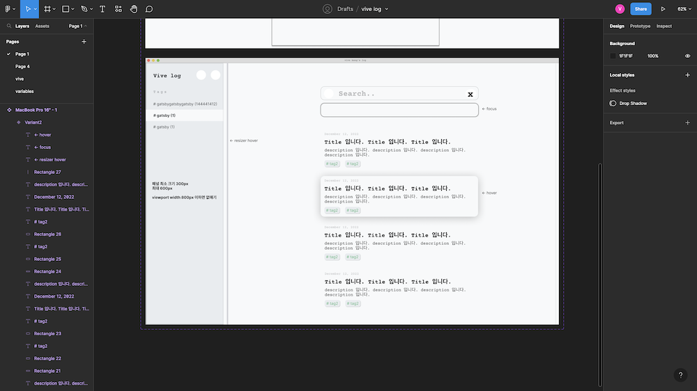
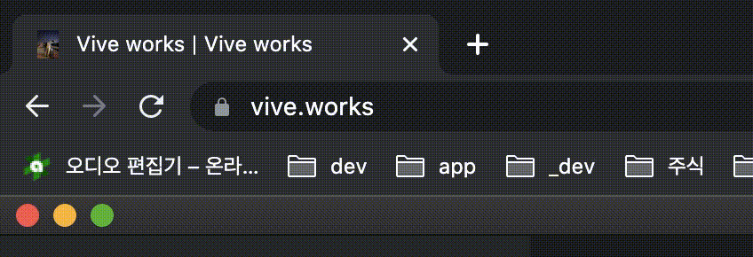

개발을 시작한 지 얼마 안 되었을 때 개인 블로그를 제작한 적이 있다. 부족한 실력이지만 Django로 서버도 만들었고, CRA로 프론트도 만들고, docker를 이용해 배포까지 하면서 나름 고군분투했었다. 무슨 자신감이었는지 그 당시의 목표는 외부 패키지를 최대한 쓰지 않고 게시글 + 댓글 기능(심지어 에디터도 직접 만들려고 했었다)과 포트폴리오 겸 개인 프로젝트 정리하는 기능을 넣으려 했다. 지금 돌이켜보면 그 용기에 박수를 쳐주고 싶다. 당연히 제대로 완성하지 못했다. 어느정도 포트폴리오랑 게시판의 구색을 갖출 무렵 회사에 들어가게 되면서 점점 할애하는 시간이 적어졌고 그렇게 잊고 지내다가 어느 순간 서버를 내리게 되었다.

실패는 아니지만 성공적이라고도 볼 수 없는 그때의 기억때문인지, 그 후로도 계속 개인 블로그 제작에 대한 욕심을 갖고 있었는데 최근 gatsby에 대한 호기심과 맞물려 다시 한번 만들기로 마음 먹었다.

# 이번엔 디자인부터 제대로!
예전에는 디자인을 따로 생각하지 않고 내키는 대로 만들었다. 일단 코드를 작성하고 나서 화면에 보이는 디자인이 이상하면 그때그때 고치는 식으로 진행을 했었지만, 이번에는 figma를 이용해 디자인부터 시작했다. 더불어 dark/light theme 각각의 색상도 정하고 shade(100-900)도 정했다.



> 미흡하지만 개인 프로젝트를 하는 수준에서는 이정도만 해도 충분하다고 생각했다.

그 효과는 굉장했다! 디자인을 하고 코드를 작성하는 것과 맨바닥에서 시작하는 건 진짜 천지차이라는 걸 직접 체감할 수 있었다. 작업 속도가 훨씬 빨라지는 건 당연하고 개발할 때는 개발만, 디자인할 때는 디자인만 집중해서 한가지만 한다는 게 엄청난 메리트라는 게 느껴졌다. 

# Gatsby
Gatsby를 한번도 사용해본 적이 없기에 공식 문서부터 쭉 훑기 시작했다. 공식 문서가 엄청 친절하다고 느꼈다. 필요할 법한 기능들에 대해서 어떤 패키지를 쓰는 게 좋고, 어떤 플러그인을 쓰는 게 좋고... 등 gatsby 측에서 권장하는 방식에 대해 다 기술해 놓았다. 예를 들어, 검색 기능에는 [algoria search](https://www.gatsbyjs.com/docs/adding-search-with-algolia)를, 페이지 전체적인 layout 적용을 위해서는 [gatsby-plugin-layout](https://www.gatsbyjs.com/docs/adding-search-with-algolia) 이라는 플러그인을 추천한다. 물론 이게 무조건 좋은 점이라 보기는 어렵지만 수많은 플러그인들 속에서 선택지를 좁혀주는 건 정말 마음에 들었다.

그렇다고 마냥 쉬운 프레임워크라고 느껴지지 않았는데, gatsby를 사용하기 위해서는 gatsby 자체가 내부에서 어떻게 돌아가는지 잘 알아야 했다. graphql 사용법도 어느정도 알아야 하고, gatsby 만의 page query 방식, `gatsby-*` 파일들에 대한 내용 등 추가적으로 공부해야 할 게 꽤 있다는 느낌을 받았다. 그리고 플러그인도 결국엔 gatsby 측에서 만든 게 아닌 개인 개발자들이 만든 거라 무작정 사용하기는 힘들었다. 그래서 내부 코드를 살펴보고 직접 구현할만한 것들은 직접 작성하는 식으로 하느라 좀 더디게 진행되었다.

## SEO
이번 블로그는 SEO에 신경을 최대한 쓰려고 했다. 신경 쓴다고는 했지만 사실 애초에 정적 사이트로 빌드를 했기 때문에 어려울 게 없었다. react-helmet을 이용해 페이지별로 다른 meta data를 설정해주고, sitemap, robots 설정을 해주었다.
그리고 네이버 서치어드바이저와 구글 서치 콘솔에 사이트 등록도 마쳤다. 

### HEAD API
`gatsby@4.19.0` 부터 `Head` api가 추가되었다. 기존에는 `react-helmet`이라는 외부 패키지로 주로 사용해왔던 페이지별 head tag를 설정해주는 기능을 담고 있다. [공식 사이트](https://www.gatsbyjs.com/docs/reference/built-in-components/gatsby-head/)에서도 `react-helmet`에 비해 여러 이점이 있으니 사용할 것을 권장한다.

하지만 `react-helmet`을 사용했다. 모든 `.mdx` 파일에 공통적으로 적용되는 template을 사용 중이었고, template 컴포넌트는 page가 아니기 때문에 `Head` api를 사용할 수 없었다. 그래서 template 컴포넌트 내에서 일괄적으로 head tag를 적용하기 위해 `react-helmet`을 사용했다. 
```jsx
// example.mdx
---
id: '1'
title: 'post title'
---

<head>
  <title>title</title>
  <meta name='description' content="description..." />
  ...
</head>

# Heading1
...

```

물론 `.mdx` 파일 안에 이런 식으로 하나하나 세팅해줘도 되긴 하지만 매번 이렇게 하는 게 번거롭다고 생각했고 template에서 한번에 처리해주는 게 더 낫다고 생각했다.

### flickering error
template 컴포넌트에는 `react-helmet`을 사용했지만 `pages/`의 페이지들에는 `Head` api를 사용했다. 그러자 index 페이지에서 최초 로딩 시 404 flickering 에러가 발생했다.



이게 보기보다 큰 문제인게, 크롤러에서 홈 화면을 404 페이지로 인식해버린다. 즉, 홈 화면의 title, description, og 등 메타 데이터들이 404 페이지의 데이터로 잡힌다는 뜻이다. 몇 년 전부터 [이슈](https://github.com/gatsbyjs/gatsby/issues/5329)로 등록된 내용이 있긴 한데 추천을 가장 많이 받은 답변도 크게 도움이 안 되었다. 너무 해결이 안 되어서 하염없이 이것만 보고 있기 보단 잠시 손을 놓고 다른 작업부터 했다. 근데 나중에 다시 확인해보니 에러가 해결이 되어있더라. 흠...

> 동일한 에러가 발생하고 있다면 댓글로 알려주시면 감사하겠습니다. 도움이 될 지 모르겠지만 오류를 추적하는 데 도움을 드리고자 합니다. 사실 원인이 너무 궁금하기 때문에...

## MDX
처음엔 `.md`로 세팅을 했다가 `.mdx`로 수정해주었다. tag들을 내가 직접 커스텀할 수 있다는 점이 마음에 들었다. 당장 세어보니 13개나 되는 tag를 커스터마이징 해놓았다. `@mdx-js/react` v1에서는 code, inlineCode를 구분해서 커스텀이 가능했는데, v2에서는 inlineCode가 없어졌다. 그래서 결국 코드 블럭으로 주로 사용하던 `<pre>` tag를 codeBlock으로 커스텀하여 사용하고 있다. `<code>` tag만 커스텀하여 사용하게 되면 결국 inlineCode와 codeBlock이 동시에 동일한 스타일로 적용되는데, 누가 이렇게 쓰려고 할지.... 어차피 대부분 따로 커스텀해서 사용할텐데 왜 없앴는지 의문이 든다.

> 추가로 `.mdx`가 정적 사이트를 만들 때 사용되다보니 next에서도 사용할 수 있지 않을까 싶었는데 [역시 있었다.](https://nextjs.org/docs/advanced-features/using-mdx) 설정 조금만 해주면 gatsby에서 사용하던 방식이랑 거의 유사하게 사용이 가능해보였다. next에서 rust 기반의 MDX 컴파일러를 준비 중이던데 추후 정식 출시가 되면 얼마나 속도 차이가 날지 기대도 된다.

### 부끄러운 AST 에러
개발하는 중에 가장 오래 붙잡고 있었던 어처구니 없었던 에러(실수)가 있었는데 다시 반복하지 않도록 짚고 넘어가려 한다.
```ts
// gatsby-node.ts
createPage<PageContext>({
  component: `${postTemplatePath.trim()}?__contentFilePath=${node.internal.contentFilePath}`,
  ...
})
```

`.md`에서 `.mdx`로 바꾸느라 `?_contentFilePath=${node.internal.contentFilePath}` 부분을 추가해주면서 에러가 발생했다.

> Invalid AST. Parsed source code did not 'return' valid output.

처음에는 이것저것 검색을 통해 해결해려 했는데 레퍼런스가 너무 부족했고, 한참을 헤매다가 안 되겠다 싶어 아예 gatsby를 클론받아서 오류 문구로부터 코드를 역추적했다.
```js
// gatsby-layout-loader.ts
const tree = acorn.Parser.extend(JSX()).parse(source, {
    ecmaVersion: 2020,
    sourceType: `module`,
    locations: true,
})
```

acorn으로 파싱하는 부분에서 에러가 나는 게 확인되었다. `source`로 들어가는 내 코드가 문제라는 뜻인데, 나중에 원인을 파악했을 땐 정말 아차 싶었다. ts 트랜스파일을 안 해주고 있었던 게 문제였다... ts를 js로 트랜스파일 하지도 않고 바로 파싱하려 했으니 안 될 수 밖에. `@babel/preset-typescript`이나 `gatsby-plugin-typescript`를 추가해주니 무슨 일 있었냐는 듯 깔끔하게 해결되었다. 젠장.

찾아보니 타입스크립트는 타입스크립트만의 AST 구조를 별도로 갖고 있다고 한다. 타입스크립트를 파싱해 AST를 만들고 이 AST를 통해 자바스크립트로 변환한다. 생각해보면 타입스크립트와 자바스크립트가 같은 AST 구조를 갖고 있다는 게 말이 안 된다. 같은 구조를 가지려면 타입스크립트 parser가 코드를 AST로 변환시킬 때부터 타입 관련 코드들을 전부 제외 시켜줘야 하는데 이건 parser의 영역이 아니라는 생각이 든다.

## pre commit
lint 체크, type 체크, 테스트 실행 이 3가지는 자동화를 시켜놓지 않으면 자주 깜빡하기도 하고 때로는 번거롭기도 해서 종종 안 하고 넘어가게 된다. 그래서 아예 commit 할 때 이 3가지를 다 통과해야만 커밋이 되도록 git hook을 걸어 두었다. 처음에는 **`lint-staged`** 와 **`pre-commit`** 이라는 패키지를 이용했다. 패키지 자체도 괜찮아보였고 어차피 여러가지 git hook들 중에 pre commit 만 사용할 거니까. 다만 사용하는 내내 찜찜했던 건 last published가 6년 전이라는 것. 분명 더 괜찮은 게 나왔을텐데 하는 마음으로 좀 찾아보니 **`husky`** 라는 패키지가 있었다. **`pre-commit`** 패키지보다 훨씬 가벼우면서 모든 종류의 git hook을 지원하고 있었기에 교체를 안 할 이유가 없었고 바로 교체해주었다.

```json
"scripts": {
  "prepare": "husky install"
},
```
`husky` 세팅을 하면서 **life cycle scripts**에 대해 알게 되었다. `prepare`은 패키지를 설치한 후에 실행되는 script다. [yarn 문서](https://yarnpkg.com/advanced/lifecycle-scripts)와 [npm 문서](https://docs.npmjs.com/cli/v8/using-npm/scripts)에 다른 hook들도 소개되어 있는데 다 읽어보진 못 했고 시간날 때 한번 쭉 읽어봐야겠다.

# 마무리
우여곡절 끝에 1차적으로 블로그를 완성했다. 배포까지 대략 한 달쯤 걸렸나? 블로그를 만들면서 정말 많이 배웠다. 오류를 해결해나가는 과정에서 새로운 내용도 많이 알게 되었고 기존에 애매하게 알던 내용들이 정리가 되기도 했다. 글이 너무 길어질까봐 이 글에 못 담은 내용들도 몇몇 있는데 다른 글에서 얼른 정리해보고 싶다.

계속해서 수정 사항이 생기고 있고, 앞으로 추가 예정인 것들도 꽤 남았고, 또 이전 블로그에서 글도 옮겨와야 하는 등 할 일이 아직 좀 있다. 블로그를 만들면서 시간이 되게 빨리 갔는데 남은 일도 차근차근 하다보면 어느샌가 끝나 있지 않을까 싶다. 앞으로 최소한 한 달에 하나씩은 포스팅을 할 예정이다. 블로그를 새로 만든 만큼 나름의 목표를 정했다. 공부한 것/알게된 것을 정리하는 글을 써도 되고 글을 쓰기 위해 관심있는 부분에 대해 공부해도 된다고 생각한다. 어쨋든 새로운 것을 배우게 될 거고 나는 성장할 테니까.

---

잘못된 내용이 있으면 댓글로 피드백 부탁드립니다.